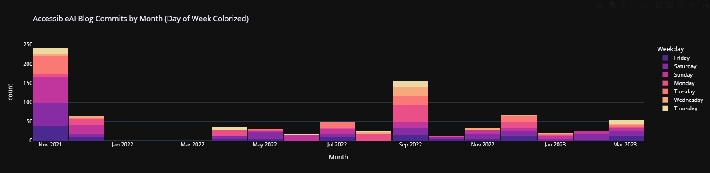
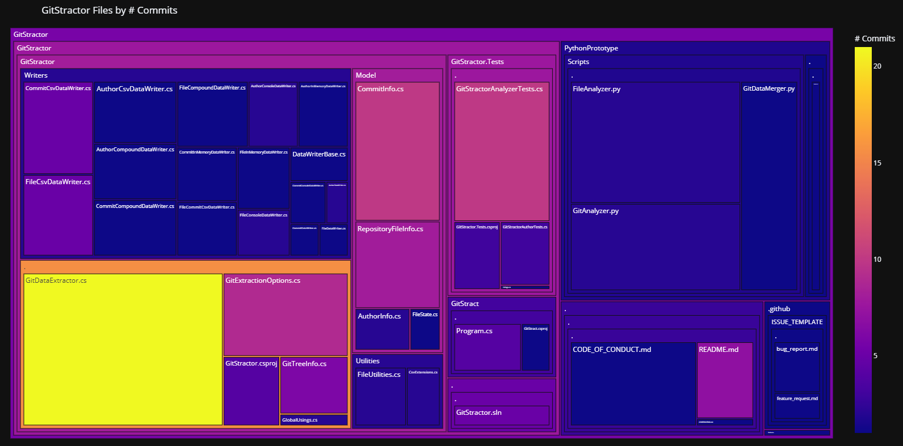
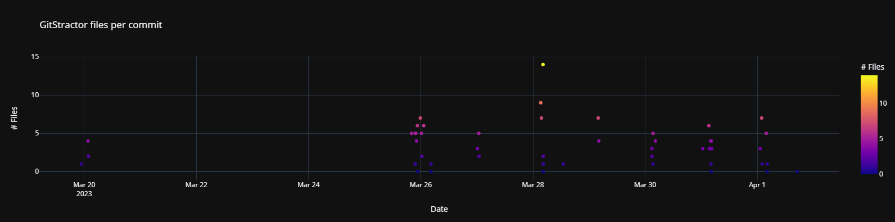
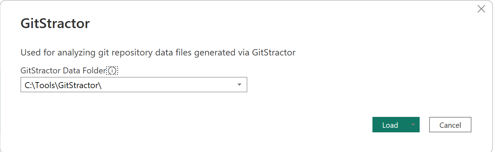
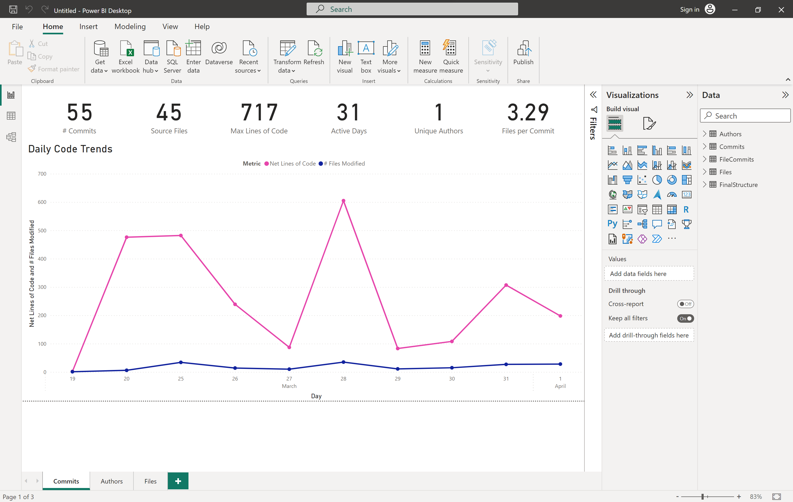

# GitStractor - Git Repository Analysis Tool
Project by [Matt Eland](https://LinkedIn.com/in/matteland) ([@IntegerMan](https://twitter.com/IntegerMan))

This project is built for extracting commit, author, and file data from local git repositories in order to visualize repository history and trends to provide insight to software development teams and their stakeholders.

Here are a few examples of the types of visualizations that can be generated using GitStractor:

Stacked bar chart of # of commits per month by day of week:

Tree map of the # of commits per file:

Scatter plot of files in each commit:

See [the Jupyter Notebook](Notebooks/GitStractor.ipynb) and the Power BI instructions below for additional visualization examples.

## Project Status

This project is currently usable, but considered in a pre-release state. It is currently missing documentation, polish, and the full range of features I intend to add.

Additionally, the desktop version of GitStractor is not yet available and visualization must be performed in a Jupyter Notebook which will require some setup on your part.

If you are not yet comfortable setting up a Jupyter Notebook, I recommend waiting until the desktop version is available.

## Usage Instructions

GitStractor currently has two components:
- A command line tool for extracting data from a local git repository
- A Jupyter notebook for visualizing the extracted data

### Extracting Commit Data

To get started, you'll need to run the `GitStractor` project in the `GitStractor\GitStractor.sln` solution. This will build the command line tool and place it in the project's binary folder.

Once that file is generated, run the following command to extract data from a local git repository:

    gitstract.exe "C:\Local\Git\Repository\Path"

This will create a series of comma-separated value (CSV) files in the same folder as the `gitstract.exe` file.

### Visualizing Commit Data in Jupyter Notebooks

To view the full range of data visualizations in Jupyter Notebooks, open the `GitStractor.ipynb` Jupyter notebook in the `Notebooks` folder. 

In there, you will need to customize the `data_dir` variable to point to the folder where you extracted the data.

I also recommend you change `project_name` to be something appropriate to your project as this value appears on most charts.

### Visualizing Commit Data in Power BI

GitStractor comes with a [Power BI desktop](https://powerbi.microsoft.com/en-us/desktop/) template that can be used to visualize your code without additional configuration steps.

To view the Power BI visuals, open the `GitStractor.pbit` template file in the `PowerBI` directory.

> Note: Do not open the `GitStractor.pbix` file to visualize your data as this stores the GitStractor project metrics.

When you open the Power BI template you will need to provide a value for the `GitStractor Data Folder` parameter.

This should be the path to the folder containing your `.csv` files and should end with a `\`.

Once you have configured the parameter and clicked Load, Power BI will reference your data and populate its visuals as shown below:

You can also click on the tabs at the bottom of the page to view information on Authors and File Structure.

## What's Next?

Future efforts on this project will focus on:

- Expanding the range of visualizations available in the Jupyter notebook
- Improving the user experience pulling data from larger repositories
- Expanding the Range of Power BI Visualizations through additional measures, tabs, and visuals
- Creating a desktop application for extracting and visualizing data

If you'd like to submit a feature request or view the current backlog, please visit the [GitHub Issues tab](https://github.com/IntegerMan/gitstractor/issues)

## Contact

Contact [Matt Eland](https://MattEland.dev) for general questions and feedback.

Please open an issue for enhancement requests and bug reports.
